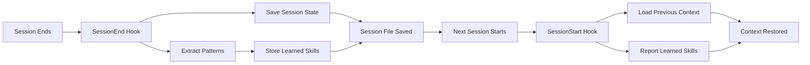

Session lifecycle hooks help maintain continuity between Claude Code sessions by preserving context, learning patterns, and detecting project configuration.

## SessionStart Hook

Runs when a new Claude session starts. Loads the most recent session summary into Claude's context.

### What It Does

<AccordionGroup>
  <Accordion title="Load Previous Session Context">
    Searches for recent session files (last 7 days) and injects the most recent session summary into Claude's context via stdout.
    
    ```javascript
    const recentSessions = findFiles(sessionsDir, '*-session.tmp', { maxAge: 7 });
    if (recentSessions.length > 0) {
      const content = readFile(latest.path);
      output(`Previous session summary:\n${content}`);
    }
    ```
  </Accordion>
  
  <Accordion title="Report Learned Skills">
    Checks for learned skills in the learned skills directory and reports how many are available.
    
    ```javascript
    const learnedSkills = findFiles(learnedDir, '*.md');
    if (learnedSkills.length > 0) {
      log(`[SessionStart] ${learnedSkills.length} learned skill(s) available`);
    }
    ```
  </Accordion>
  
  <Accordion title="List Session Aliases">
    Reports available session aliases that can be loaded with `/sessions load <alias>`.
    
    ```javascript
    const aliases = listAliases({ limit: 5 });
    if (aliases.length > 0) {
      log(`[SessionStart] ${aliases.length} session alias(es) available: ${aliasNames}`);
    }
    ```
  </Accordion>
  
  <Accordion title="Detect Package Manager">
    Automatically detects the package manager (npm, pnpm, yarn, bun) and reports it to Claude.
    
    ```javascript
    const pm = getPackageManager();
    log(`[SessionStart] Package manager: ${pm.name} (${pm.source})`);
    ```
  </Accordion>
  
  <Accordion title="Detect Project Type">
    Identifies project languages and frameworks (TypeScript, React, Next.js, Python, Go, etc.).
    
    ```javascript
    const projectInfo = detectProjectType();
    if (projectInfo.languages.length > 0 || projectInfo.frameworks.length > 0) {
      output(`Project type: ${JSON.stringify(projectInfo)}`);
    }
    ```
  </Accordion>
</AccordionGroup>

### Hook Configuration

```json hooks.json
{
  "SessionStart": [
    {
      "matcher": "*",
      "hooks": [
        {
          "type": "command",
          "command": "node \"${CLAUDE_PLUGIN_ROOT}/scripts/hooks/session-start.js\""
        }
      ],
      "description": "Load previous context and detect package manager on new session"
    }
  ]
}
```

## SessionEnd Hook

Runs when a Claude session ends. Persists session state for the next session.

### What It Does

<AccordionGroup>
  <Accordion title="Persist Session State">
    Saves the current session summary, including tasks completed, decisions made, and context to preserve.
  </Accordion>
  
  <Accordion title="Evaluate Session for Patterns">
    Analyzes the session to identify extractable patterns and learnings that can be saved as skills.
    
    This enables continuous learning—the system gets smarter over time by capturing recurring patterns.
  </Accordion>
</AccordionGroup>

### Hook Configuration

```json hooks.json
{
  "SessionEnd": [
    {
      "matcher": "*",
      "hooks": [
        {
          "type": "command",
          "command": "node \"${CLAUDE_PLUGIN_ROOT}/scripts/hooks/session-end.js\""
        }
      ],
      "description": "Persist session state on end"
    },
    {
      "matcher": "*",
      "hooks": [
        {
          "type": "command",
          "command": "node \"${CLAUDE_PLUGIN_ROOT}/scripts/hooks/evaluate-session.js\""
        }
      ],
      "description": "Evaluate session for extractable patterns"
    }
  ]
}
```

## Session Persistence Flow



## Session Storage

Session files are stored in:
- **Sessions directory**: `~/.claude/sessions/`
- **Session files**: `YYYY-MM-DD-session.tmp`
- **Learned skills**: `~/.claude/learned-skills/`
- **Compaction log**: `~/.claude/sessions/compaction-log.txt`

## Benefits

<CardGroup cols={2}>
  <Card title="Continuity" icon="link">
    Pick up where you left off without repeating context
  </Card>
  <Card title="Learning" icon="brain">
    System learns from patterns and improves over time
  </Card>
  <Card title="Configuration" icon="gear">
    Automatic detection of package manager and project type
  </Card>
  <Card title="History" icon="clock-rotate-left">
    Track compaction events and session evolution
  </Card>
</CardGroup>

## Related

- [PreCompact Hook](/hooks/strategic-compact) — Save state before context compaction
- [Custom Hooks](/hooks/custom-hooks) — Create your own lifecycle hooks