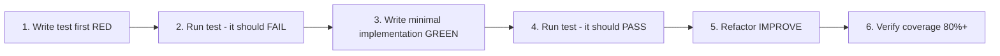

Common rules define language-agnostic principles that apply broadly across all projects. Language-specific rules can extend or override these where language idioms differ.

## Coding Style

### Immutability (CRITICAL)

<Warning>
  ALWAYS create new objects, NEVER mutate existing ones.
</Warning>

```
// Pseudocode
WRONG:  modify(original, field, value) → changes original in-place
CORRECT: update(original, field, value) → returns new copy with change
```

**Rationale**: Immutable data prevents hidden side effects, makes debugging easier, and enables safe concurrency.

### File Organization

<Card title="MANY SMALL FILES > FEW LARGE FILES" icon="files">
  - High cohesion, low coupling
  - 200-400 lines typical, 800 max
  - Extract utilities from large modules
  - Organize by feature/domain, not by type
</Card>

### Error Handling

ALWAYS handle errors comprehensively:

<AccordionGroup>
  <Accordion title="Handle errors explicitly at every level">
    Never use try-catch blocks that swallow errors without logging or re-throwing.
  </Accordion>
  <Accordion title="Provide user-friendly error messages in UI-facing code">
    Error messages shown to users should be clear, actionable, and non-technical.
  </Accordion>
  <Accordion title="Log detailed error context on the server side">
    Include stack traces, request IDs, user context, and other debugging information.
  </Accordion>
  <Accordion title="Never silently swallow errors">
    Even if you can't handle an error, at minimum log it before continuing.
  </Accordion>
</AccordionGroup>

### Input Validation

ALWAYS validate at system boundaries:

- Validate all user input before processing
- Use schema-based validation where available
- Fail fast with clear error messages
- Never trust external data (API responses, user input, file content)

### Code Quality Checklist

Before marking work complete:

- [ ] Code is readable and well-named
- [ ] Functions are small (&lt;50 lines)
- [ ] Files are focused (&lt;800 lines)
- [ ] No deep nesting (&gt;4 levels)
- [ ] Proper error handling
- [ ] No hardcoded values (use constants or config)
- [ ] No mutation (immutable patterns used)

## Testing

### Minimum Test Coverage: 80%

Test Types (ALL required):

<Steps>
  <Step title="Unit Tests">
    Individual functions, utilities, components
  </Step>
  <Step title="Integration Tests">
    API endpoints, database operations
  </Step>
  <Step title="E2E Tests">
    Critical user flows (framework chosen per language)
  </Step>
</Steps>

### Test-Driven Development

MANDATORY workflow:



### Troubleshooting Test Failures

1. Use **tdd-guide** agent
2. Check test isolation
3. Verify mocks are correct
4. Fix implementation, not tests (unless tests are wrong)

### Agent Support

<Card title="tdd-guide" icon="robot">
  Use PROACTIVELY for new features, enforces write-tests-first
</Card>

## Security

### Mandatory Security Checks

Before ANY commit:

- [ ] No hardcoded secrets (API keys, passwords, tokens)
- [ ] All user inputs validated
- [ ] SQL injection prevention (parameterized queries)
- [ ] XSS prevention (sanitized HTML)
- [ ] CSRF protection enabled
- [ ] Authentication/authorization verified
- [ ] Rate limiting on all endpoints
- [ ] Error messages don't leak sensitive data

### Secret Management

<AccordionGroup>
  <Accordion title="NEVER hardcode secrets in source code">
    Secrets include API keys, passwords, tokens, private keys, connection strings.
  </Accordion>
  <Accordion title="ALWAYS use environment variables or a secret manager">
    Load secrets from `.env` files (not committed) or a secret management service.
  </Accordion>
  <Accordion title="Validate that required secrets are present at startup">
    Fail fast if critical secrets are missing rather than failing later with cryptic errors.
  </Accordion>
  <Accordion title="Rotate any secrets that may have been exposed">
    If a secret is accidentally committed, immediately rotate it and invalidate the old one.
  </Accordion>
</AccordionGroup>

### Security Response Protocol

If security issue found:

<Steps>
  <Step title="STOP immediately">
    Do not continue with feature development
  </Step>
  <Step title="Use security-reviewer agent">
    Get comprehensive security audit
  </Step>
  <Step title="Fix CRITICAL issues before continuing">
    Address all high-severity vulnerabilities
  </Step>
  <Step title="Rotate any exposed secrets">
    Invalidate compromised credentials
  </Step>
  <Step title="Review entire codebase for similar issues">
    Check if the pattern is repeated elsewhere
  </Step>
</Steps>

## Patterns

### Skeleton Projects

When implementing new functionality:

<Steps>
  <Step title="Search for battle-tested skeleton projects">
    Look for well-maintained templates with good documentation
  </Step>
  <Step title="Use parallel agents to evaluate options">
    - Security assessment
    - Extensibility analysis
    - Relevance scoring
    - Implementation planning
  </Step>
  <Step title="Clone best match as foundation">
    Start with proven structure
  </Step>
  <Step title="Iterate within proven structure">
    Customize while maintaining best practices
  </Step>
</Steps>

### Repository Pattern

Encapsulate data access behind a consistent interface:

<AccordionGroup>
  <Accordion title="Define standard operations">
    findAll, findById, create, update, delete
  </Accordion>
  <Accordion title="Concrete implementations handle storage details">
    Database, API, file, in-memory, etc.
  </Accordion>
  <Accordion title="Business logic depends on the abstract interface">
    Not the storage mechanism
  </Accordion>
  <Accordion title="Benefits">
    Enables easy swapping of data sources and simplifies testing with mocks
  </Accordion>
</AccordionGroup>

### API Response Format

Use a consistent envelope for all API responses:

- Include a success/status indicator
- Include the data payload (nullable on error)
- Include an error message field (nullable on success)
- Include metadata for paginated responses (total, page, limit)

## Git Workflow

### Commit Message Format

```
<type>: <description>

<optional body>
```

**Types**: feat, fix, refactor, docs, test, chore, perf, ci

<Info>
  Attribution disabled globally via ~/.claude/settings.json.
</Info>

### Pull Request Workflow

When creating PRs:

<Steps>
  <Step title="Analyze full commit history">
    Not just latest commit
  </Step>
  <Step title="Use git diff [base-branch]...HEAD">
    See all changes since branch diverged
  </Step>
  <Step title="Draft comprehensive PR summary">
    Explain what changed and why
  </Step>
  <Step title="Include test plan with TODOs">
    Document how changes were tested
  </Step>
  <Step title="Push with -u flag if new branch">
    Set upstream tracking
  </Step>
</Steps>

## Hooks

### Hook Types

<CardGroup cols={3}>
  <Card title="PreToolUse" icon="circle-stop">
    Before tool execution (validation, parameter modification)
  </Card>
  <Card title="PostToolUse" icon="circle-check">
    After tool execution (auto-format, checks)
  </Card>
  <Card title="Stop" icon="hand">
    When session ends (final verification)
  </Card>
</CardGroup>

### Auto-Accept Permissions

<Warning>
  Use with caution:
  - Enable for trusted, well-defined plans
  - Disable for exploratory work
  - Never use dangerously-skip-permissions flag
  - Configure `allowedTools` in `~/.claude.json` instead
</Warning>

### TodoWrite Best Practices

Use TodoWrite tool to:

- Track progress on multi-step tasks
- Verify understanding of instructions
- Enable real-time steering
- Show granular implementation steps

Todo list reveals:
- Out of order steps
- Missing items
- Extra unnecessary items
- Wrong granularity
- Misinterpreted requirements

## Related

<CardGroup cols={3}>
  <Card title="TypeScript Rules" icon="js" href="/rules/typescript-rules">
    TypeScript-specific extensions
  </Card>
  <Card title="Python Rules" icon="python" href="/rules/python-rules">
    Python-specific extensions
  </Card>
  <Card title="Go Rules" icon="golang" href="/rules/golang-rules">
    Go-specific extensions
  </Card>
</CardGroup>